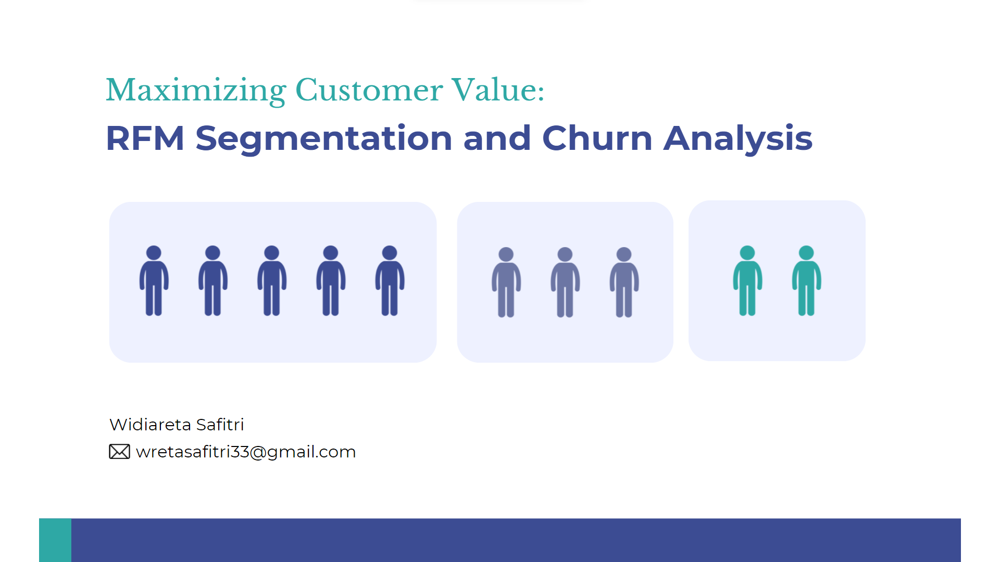

# Maximizing Customer Value:  RFM Segmentation and Churn Analysis

## Problem Background
In today's competitive business landscape, understanding and retaining customers is critical. Customer churn, or the rate at which customers stop doing business with a company, poses significant challenges for organizations in various industries such as having to look for new customers instead of having loyal customers which will incur more costs. To overcome this challenge, businesses can utilize data-driven strategies such as RFM Customer Segmentation. 

RFM segmentation is a data-driven technique used to categorize customers based on three key factors: Recency (R), Recency (R), Monetary (M). By segmenting customers based on these metrics, businesses can gain valuable insights into customer behavior and then can correlate that customer behavior with customer churn.

## Objective
- Segmenting Customers into Four Groups Using the RFM Approach
- Identifying Potential Churn Customers Based on Customer Segmentation
- Analyze Churn Probability from Customer

## Data Sources
Datasets : [Online Retail Project](https://www.kaggle.com/datasets/ulrikthygepedersen/online-retail-dataset)

## Deck Presentation
 A more detailed explanation of RFM Segmentation and Churn Analysis on the deck is available at the following link:

Presentation Link: [Maximizing Customer Value:  RFM Segmentation and Churn Analysis]( https://www.canva.com/design/DAFuNsddcUk/iy32ebVAK-t9zDV_l9GnWw/view?utm_content=DAFuNsddcUk&utm_campaign=designshare&utm_medium=link&utm_source=publishsharelink)

#### Widiareta Safitri
📧 : wretasafitri33@gmail.com